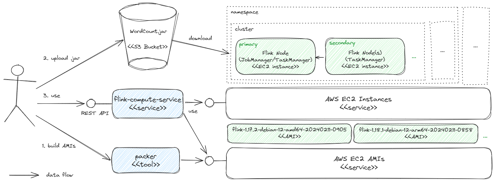

# flink-compute-service

[](https://github.com/akornatskyy/flink-compute-service/actions/workflows/tests.yml) [](https://www.npmjs.com/package/flink-compute-service)

Run Flink application on AWS EC2.



## Usage

Prepare:

1. Update `.env.example` to match your AWS network environment and
source with `. .env.example`.
2. Use packer to build AMI images (see [here](./misc/packer/README.md)).

Run:

```sh
API_AUTH_TOKEN=secret npx flink-compute-service
```

## API

Versioning is done at the API level (rather than at the resource or field
level).

If you use any alpha API versions, check in case the API did change in
incompatible ways prior to upgrade.

### GET /api/v1alpha1/images?architecture={arm64|x86_64}&name={pattern}

List available images.

Request version 1.17:

```text
/api/v1alpha1/images?architecture=arm64&name=flink-1.17.*
```

Response:

```json
{
    "images": [
        {
            "id": "ami-0178e4bfac4d5a6c6",
            "name": "flink-1.17.2-debian-12-arm64-20240211-0913",
            "createTime": "2024-02-11T09:14:07.000Z",
            "architecture": "arm64"
        }
    ]
}
```

### GET /api/v1alpha1/namespaces/:namespace/clusters

List clusters.

Response:

```json
{
    "clusters": [
        {
            "id": "b51c5782b0"
        }
    ]
}
```

### GET /api/v1alpha1/namespaces/:namespace/clusters/:id/instances

List cluster instances.

Response:

```json
{
    "instances": [
        {
            "id": "i-03780b47356565a90",
            "role": "SECONDARY",
            "imageId": "ami-0072c08c2b3623443",
            "instanceType": "t4g.small",
            "launchTime": "2024-02-11T12:50:33.000Z",
            "privateIpAddress": "172.31.2.146",
            "state": "RUNNING",
            "architecture": "arm64"
        },
        {
            "id": "i-03527597a634fa201",
            "role": "PRIMARY",
            "imageId": "ami-0072c08c2b3623443",
            "instanceType": "t4g.small",
            "launchTime": "2024-02-11T12:50:32.000Z",
            "privateIpAddress": "172.31.14.191",
            "state": "RUNNING",
            "architecture": "arm64"
        }
    ]
}
```

### POST /api/v1alpha1/namespaces/:namespace/clusters

Create a cluster.

> NOTE: use S3 [presigned](https://docs.aws.amazon.com/cli/latest/reference/s3/presign.html) URLs for private buckets.

```sh
aws s3 presign s3://<bucket>/WordCount.jar
```

Request all in one:

```json
{
    "imageFilter": {
        "architecture": "arm64",
        "name": "flink-1.17.*-debian-*"
    },
    "entrypoint": "org.apache.flink.streaming.examples.wordcount.WordCount",
    "sourceUrl": "https://...s3.eu-central-1.amazonaws.com/WordCount.jar?...",
    "lifetimeSeconds": 90,
    "jobManager": {
        "instanceType": "t4g.small",
        "marketType": "SPOT",
        "startTaskManager": true,
        "config": {
            "parallelism.default": 2,
            "taskmanager.numberOfTaskSlots": 2
        }
    },
    "tags": {
        "team": "eagle"
    }
}
```

Request with source on S3 bucket (use *instanceProfile* to specify EC2 instance
profile that has permission to download from S3 bucket):

```json
{
    "imageFilter": {
        "architecture": "arm64",
        "name": "flink-1.17.*-debian-*"
    },
    "entrypoint": "org.apache.flink.streaming.examples.wordcount.WordCount",
    "sourceUrl": "s3://.../WordCount.jar",
    "lifetimeSeconds": 90,
    "jobManager": {
        "instanceType": "t4g.small",
        "instanceProfile": {
            "name": "..."
        },
        "startTaskManager": true
    }
}
```

Request separate Flink Task Manager(s):

```json
{
    "imageFilter": {
        "architecture": "arm64",
        "name": "flink-1.18.*-debian-*"
    },
    "entrypoint": "org.apache.flink.streaming.examples.windowing.TopSpeedWindowing",
    "sourceUrl": "https://...s3.eu-central-1.amazonaws.com/TopSpeedWindowing.jar?...",
    "lifetimeSeconds": 90,
    "jobManager": {
        "instanceType": "t4g.micro",
        "config": {
            "parallelism.default": 2
        }
    },
    "taskManager": {
        "instanceType": "t4g.small",
        "marketType": "SPOT",
        "blockDeviceMappings": [
            {
                "deviceName": "/dev/xvda",
                "ebs": {
                    "volumeSize": 20
                }
            }
        ],
        "count": 1,
        "config": {
            "taskmanager.numberOfTaskSlots": 2
        }
    },
    "tags": {
        "team": "falkon"
    }
}
```

Response:

```json
{
    "id": "85d455dbe2"
}
```

## Deploy

TODO: AWS Lambda, Beanstalk, ECS, EKS, etc.

## References

- [Flink Configuration](https://nightlies.apache.org/flink/flink-docs-master/docs/deployment/config/)
- [Flink Resource Providers](https://nightlies.apache.org/flink/flink-docs-master/docs/deployment/resource-providers/standalone/overview)
- [AWS SDK for JavaScript v3](https://docs.aws.amazon.com/AWSJavaScriptSDK/v3/latest/client/ec2/)
